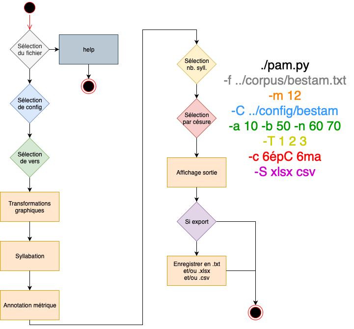

# pam - Programme d'Analyse Métrique


## Liens associés

Présentation du pam : https://www.github.com/EPgg92/pam_talk

Créer le corpus du pam : https://www.github.com/EPgg92/pam_corpus

## Pré-requis

Les droits d'administration sont nécessaires.

Le `pam` est codé en __python3__.

Installez __python3__ en suivant la documentation officielle sur :

[https://www.python.org/downloads/](https://www.python.org/downloads/)

Installez le gestionnaire de package python3 `pip3` de la manière la plus
adéquate selon votre OS.

Installez les dépendances suivantes avec ces packages :

```
sudo pip3 install pandas
sudo pip3 install pyyaml
sudo pip3 install nltk
sudo pip3 install XlsxWriter
```

## Installation

Clonez le répertoire pam :

```bash
git clone https://github.com/EPgg92/pam.git
```

Changez de répertoire :

```bash
cd pam
```

Créez un lien symbolique pour le script exécutable `pam.py` avec les droits
de super-utilisateur :
```bash
sudo ln -s  $(pwd)/script/pam.py /usr/bin/pam
```
Exécutez le script en lançant la commande :
```
pam -f nom_de_fichier.txt
```

## Usages et options :

Le `pam` a plusieurs options combinables :

```console
usage: pam [-h] -f filename [filename ...] [-g] [-m meter] [-C filename]
           [-F filename] [-S format [format ...]] [-c string [string ...]]
           [-t number [number ...]] [-T number [number ...]]
           [-n numbers [numbers ...]] [-a number] [-b number]
```


### Sélection de fichiers :
L'option `-f`, nécessaire pour l'exécution, permet de choisir le ou les fichiers sur lesquels exécuter le `pam`.

```console
$> pam -f CharretteKu2.txt bestam2.txt
Analyse de CharretteKu2.txt

 0  | 0 |0 |2  0 |0 | 1    2  -1
puis quë ma da·më dë chan·pai·gne     	num_l:1
  2  | 0 |1   2  |0| 2  -1|1   2   -1
vιalt quë ro·mans a fei·re an·prai·gne	num_l:2

Analyse de bestam2.txt

1   2  | 0 ||2 | 2  |2  0 | 1  2  -1
a·mours cui  ai fait li·gë hom·ma·ge	num_l:1
 0  | 1   1  2 |0 | 2 |1  2  -1
sans faus·se·té dë fin co·ra·ge     	num_l:2
```

### Spécification du mètre :
Spécifiez le mètre avec l'option `-m`. Cette option permet de calculer le nombre de vers bien et mal formés. Pour les mètres entre 8 et 14, le programme indique la position des coupes possibles.
Quand un mètre est spécifié, des statistiques apparaissent après le traitement.
Si plusieurs fichiers sont donnés, un troisième ensemble de statistiques concerne l'ensemble des fichiers.

```console
$> pam -f CharretteKu2.txt bestam2.txt -m8
Analyse de CharretteKu2.txt

 0  | 0 |0 |2  0 |0 | 1    2  -1      	m:8[8]	3NA/4ej/5ly
puis quë ma da·më dë chan·pai·gne     	num_l:1
  2  | 0 |1   2  |0| 2  -1|1   2   -1 	m:8[8]	3NA/4ma/5NA
vιalt quë ro·mans a fei·re an·prai·gne	num_l:2

Analyse de bestam2.txt

1   2  | 0 ||2 | 2  |2  0 | 1  2  -1	m:9[8]	3NA/4NA/5NA
a·mours cui  ai fait li·gë hom·ma·ge	num_l:1
 0  | 1   1  2 |0 | 2 |1  2  -1     	m:8[8]	3NA/4ma/5NA
sans faus·se·té dë fin co·ra·ge     	num_l:2

1 CharretteKu2.txt	m:8
100.00% soit  2  /2 vers bien formés
00.00% soit  0  /2 vers mal formés


Distribution des césures pour 2 vers:
	- 3NA	100.00% soit  2
	- 4ej	50.00% soit  1
	- 4ma	50.00% soit  1
	- 5NA	50.00% soit  1
	- 5ly	50.00% soit  1

2 bestam2.txt	m:8
50.00% soit  1  /2 vers bien formés
50.00% soit  1  /2 vers mal formés
	- m:9[8]	50.00% soit  1

Distribution des césures pour 2 vers:
	- 3NA	100.00% soit  2
	- 4NA	50.00% soit  1
	- 4ma	50.00% soit  1
	- 5NA	100.00% soit  2

3 general	m:8
75.00% soit  3  /4 vers bien formés
25.00% soit  1  /4 vers mal formés
	- m:9[8]	25.00% soit  1

Distribution des césures pour 4 vers:
	- 3NA	100.00% soit  4
	- 4NA	25.00% soit  1
	- 4ej	25.00% soit  1
	- 4ma	50.00% soit  2
	- 5NA	75.00% soit  3
	- 5ly	25.00% soit  1

```

### Résumé :
L'option `-g` permet d'afficher un résumé du nombre de vers bien et mal formés et un résumé de la distridution des césures pour les ???

```Console
$> pam -f CharretteKu10.txt bestam10.txt -g -m 8
1 CharretteKu10.txt	m:8
100.00% soit  10 /10 vers bien formés
00.00% soit  0  /10 vers mal formés


Distribution des césures pour 10 vers:
	- 3NA	80.00% soit  8
	- 3ma	20.00% soit  2
	- 4NA	50.00% soit  5
	- 4ej	10.00% soit  1
	- 4ma	40.00% soit  4
	- 5NA	50.00% soit  5
	- 5ej	10.00% soit  1
	- 5ly	10.00% soit  1
	- 5ma	20.00% soit  2
	- 5épV	10.00% soit  1

2 bestam10.txt	m:8
90.00% soit  9  /10 vers bien formés
10.00% soit  1  /10 vers mal formés
	- m:9[8]	10.00% soit  1

Distribution des césures pour 10 vers:
	- 3NA	80.00% soit  8
	- 3ma	20.00% soit  2
	- 4NA	60.00% soit  6
	- 4ma	40.00% soit  4
	- 5NA	70.00% soit  7
	- 5ej	10.00% soit  1
	- 5ma	10.00% soit  1
	- 5épV	10.00% soit  1

3 general	m:8
95.00% soit  19 /20 vers bien formés
05.00% soit  1  /20 vers mal formés
	- m:9[8]	05.00% soit  1

Distribution des césures pour 20 vers:
	- 3NA	80.00% soit  16
	- 3ma	20.00% soit  4
	- 4NA	55.00% soit  11
	- 4ej	05.00% soit  1
	- 4ma	40.00% soit  8
	- 5NA	60.00% soit  12
	- 5ej	10.00% soit  2
	- 5ly	05.00% soit  1
	- 5ma	15.00% soit  3
	- 5épV	10.00% soit  2
```

### Sélecteurs de vers :

#### Selon les numéros de vers :

Avec `-a` (_after_), séléctionnez tous les vers situés au-delà d'un numéro vers donné, celui-ci étant inclu.
Avec `-b` (_before_), séléctionnez tous les vers situés en-deça d'un numéro vers donné, celui-ci n'étant pas inclu.
Avec `-n`, sélectionnez directement les vers par leurs numéros de ligne.

```console
$> pam -f CharretteKu.txt  -a 10 -b 13 -n 600 700 800
Analyse de CharretteKu.txt

 0 |0 | 2 |0 |2  0 | 0 | 2  -1
quë ce est la da·më qui pas·se  	num_l:10
1   0 |1   0 | 0 | 2  |1   2
to·tes ce·les qui sont vi·vanz  	num_l:11
0 | 0 |0 | 2  | 2  0 | 0 | 2
si con li funs pas·së les vanz  	num_l:12
| 0 | 2 |0 |2  -1|1  1  1  2 -1
 ont pas la ro·te a·con·se·ü·e  	num_l:600
1  2  |0 |1   2   0  | 0  | 0
a·tant së de·par·tent tuit troi 	num_l:700
0 | 0 | 1   2  |0 |  2  |0 | 2
et cil res·pont jë mιalz në vuel	num_l:800
```

#### Selon les types de césures :

Avec `-c`, séléctionnez les vers selon leur type de césures.
Les types de césures sont les suivants, précédés d'un nombre sans espace compris entre [3 et 11] :
- NA
- ej
- ly
- ma
- épC
- épV
Ils sont précédés d'un nombre compris entre [3 et 11], sans espace. Ce nombre indique la position de la césure : _6épC_ correspond à une césure épique entre la sixième et la septième positions métriques.

L'option `-c` nécessite l'option `-m`.

```console
$> pam -f CharretteKu.txt  -g -m 8 -c 4ma 5ej
1 CharretteKu.txt	m:8
100.00% soit 2331/2331 vers bien formés
00.00% soit  0  /2331 vers mal formés


Distribution des césures pour 2331 vers:
	- 3NA	84.17% soit 1962
	- 3ej	00.69% soit  16
	- 3ly	02.49% soit  58
	- 3ma	12.40% soit 289
	- 3épV	00.26% soit  6
	- 4NA	14.11% soit 329
	- 4ly	00.69% soit  16
	- 4ma	85.07% soit 1983
	- 4épV	00.13% soit  3
	- 5NA	71.73% soit 1672
	- 5ej	18.23% soit 425
	- 5ma	08.88% soit 207
	- 5épV	01.16% soit  27
```

#### Selon les mètres :
Avec `-t`, conservez uniquement les vers qui correpondent au nombre de positions donné en argument.
Avec `-T`, ignorez les vers qui correspondent au nombre de positions donné en argument.
Dans le cas où les deux options sont activée, l'option `-t` est prioritaire vis-à-vis de l'option `-T`.
```console
$> pam -f bestam.txt -m8 -T 8 9 7 -g
1 bestam.txt	m:8
00.00% soit  0  /18 vers bien formés
100.00% soit  18 /18 vers mal formés
	- m:2[8]	05.56% soit  1
	- m:6[8]	16.67% soit  3
	- m:10[8]	66.67% soit  12
	- m:11[8]	11.11% soit  2

Distribution des césures pour 18 vers:
	- 3NA	100.00% soit  18
	- 4NA	100.00% soit  18
	- 5NA	100.00% soit  18
```

### Changer de configuration ou de répertoire de formes atones :

Avec l'option `-C`, sélectionnez le dossier contenant vos fichiers de configuration :
- `constants.yaml`
- `special_syll.yaml`
- `special_type.yaml`

Avec l'option `-F`, sélectionnez le dossier contenant vos fichies `.yaml` contenant vos formes atones.

### Sauvegarder des fichiers

Avec l'option `-S` vous pouvez sauvegarder vos sorties dans les formats suivants `csv`, `xslx` ou `txt`.
